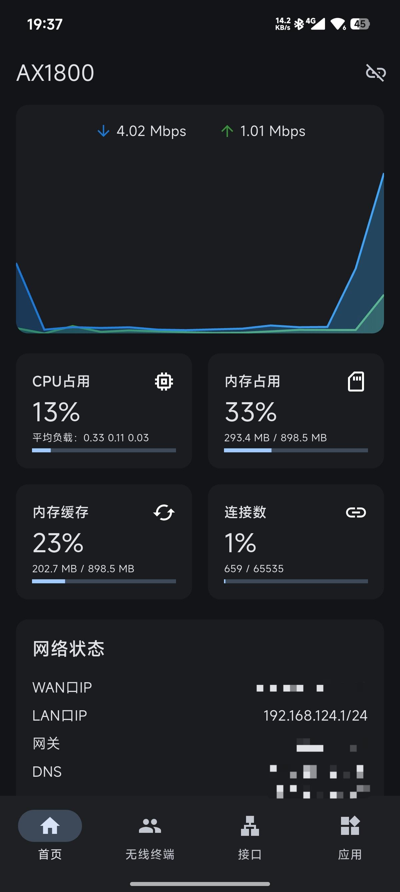
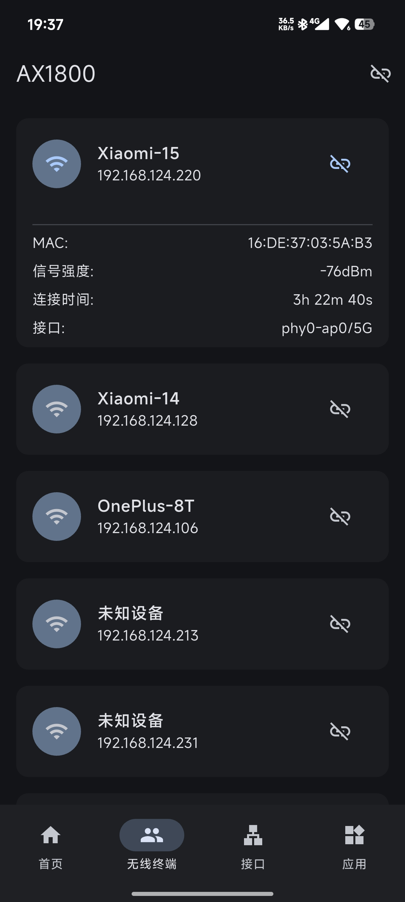
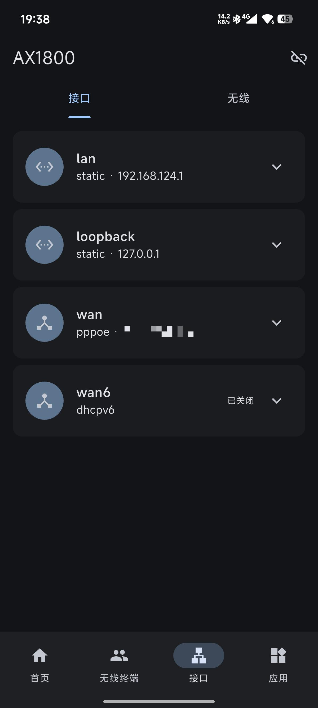

# flutter_openwrt_assistant

使用 Flutter 开发的 OpenWrt 路由器管理工具

## 截图

| 概览                                       | 无线设备 | 接口1 | 接口2 |
|---------------------------------------------|-----------|---------|------------|
|  |  |  |  |

## 感谢
[destan19/OPAssistant](https://github.com/destan19/OPAssistant)
[cogwheel0/luci-mobile](https://github.com/cogwheel0/luci-mobile)