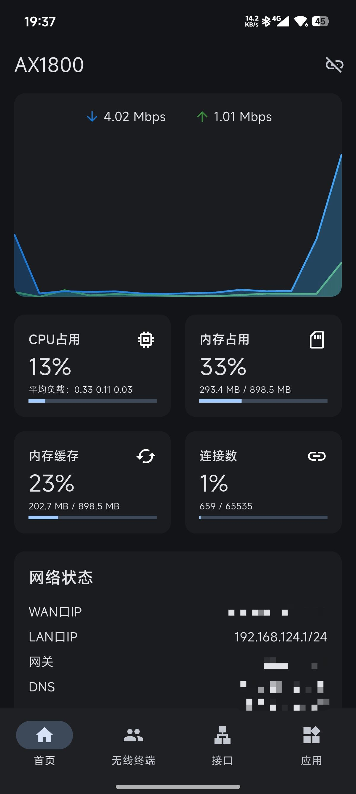
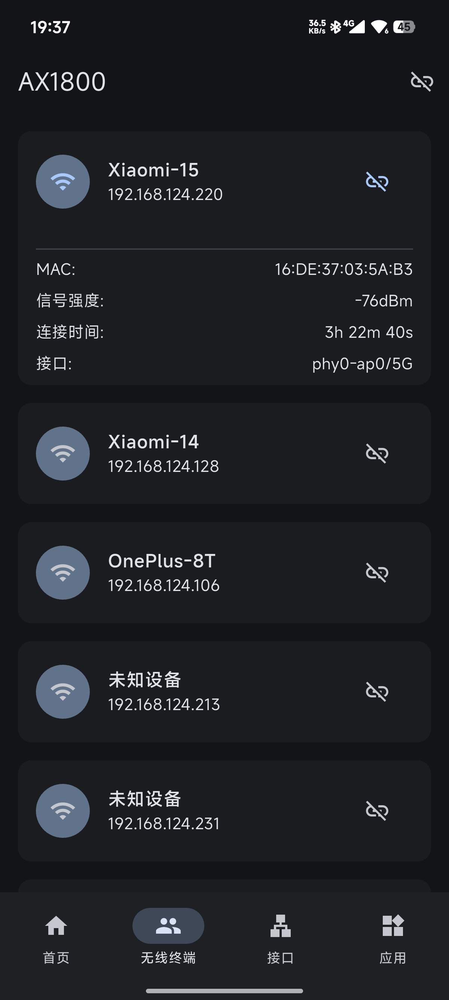
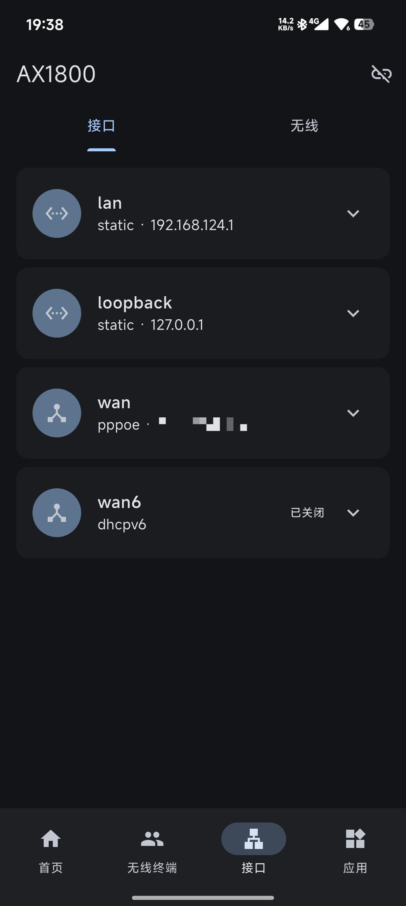

# flutter_openwrt_assistant

使用 Flutter 开发的 OpenWrt 路由器管理工具

## 截图

| 概览                                       | 无线设备 | 接口1 | 接口2 |
|---------------------------------------------|-----------|---------|------------|
|  |  |  |  |

## Android 打包

Release APK 使用本地签名配置打包。首次打包前，在 `android/key.properties` 中配置签名信息：

```properties
storePassword=<keystore 密码>
keyPassword=<key 密码>
keyAlias=<key 别名>
storeFile=<keystore 文件绝对路径>
```

执行以下命令打包：

```bash
flutter build apk --release
```

APK 产物位于：

```text
build/app/outputs/apk/release/app-release.apk
```

## 感谢
[destan19/OPAssistant](https://github.com/destan19/OPAssistant)
[cogwheel0/luci-mobile](https://github.com/cogwheel0/luci-mobile)
